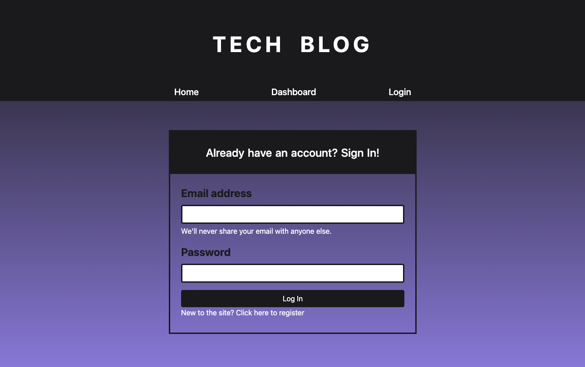

# Homework 14 - Tech Blog
* Due on 1/26/2022

## Description
* This project was a tech blog website that allowed the user to login and logout.  Upon opening the website, the user is able to see historical blog posts, but is required to log in if clicking on the dashboard to add or make changes to a blog.  The user will then have the option to view all of their specific blog posts, and then log out of the webpage when they are finished.

## ScreenShots

## Link to deployed application:
* 

## Link to repository
* https://github.com/eburger939/tech-blog
